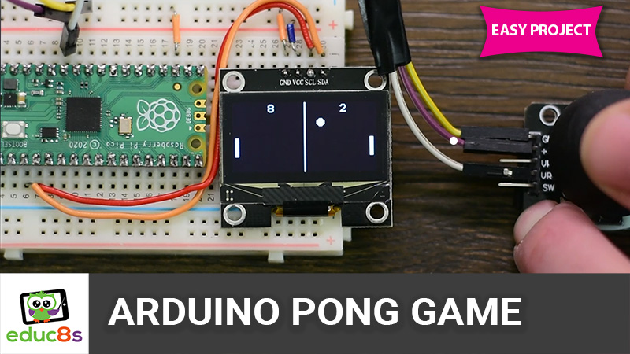

# Arduino Pong Game OLED SSH1106

This is a Pong Game on a Raspberry Pi Pico and an 1.3" OLED display with the SSH1106 driver. The Raspberry Pi Pico can update the display as fast as 60 times per second.

# Video Tutorial

  

🎥 <a href="https://youtu.be/tTsUdK7MMuI">Video Tutorial on YouTube</a>

 
 

| 📺 <a href="https://www.youtube.com/educ8s">YouTube</a>
| 🌍 <a href="http://www.educ8s.tv">Website</a> |  

# Parts Needed

🛒 OLED ▶ https://educ8s.tv/part/OLED13

🛒  Raspberry Pi Pico ▶ http://educ8s.tv/part/RaspberryPiPico

🛒 Joystick Module ▶ http://educ8s.tv/part/joystick

🛒 Breadboard ▶ http://educ8s.tv/part/SmallBreadboard

🛒 Wires ▶ http://educ8s.tv/part/Wires

🛒 Jumper Wires ▶ http://educ8s.tv/part/JumperWires

💖 Full disclosure: All of the links above are affiliate links. I get a small percentage of each sale they generate. Thank you for your support!
